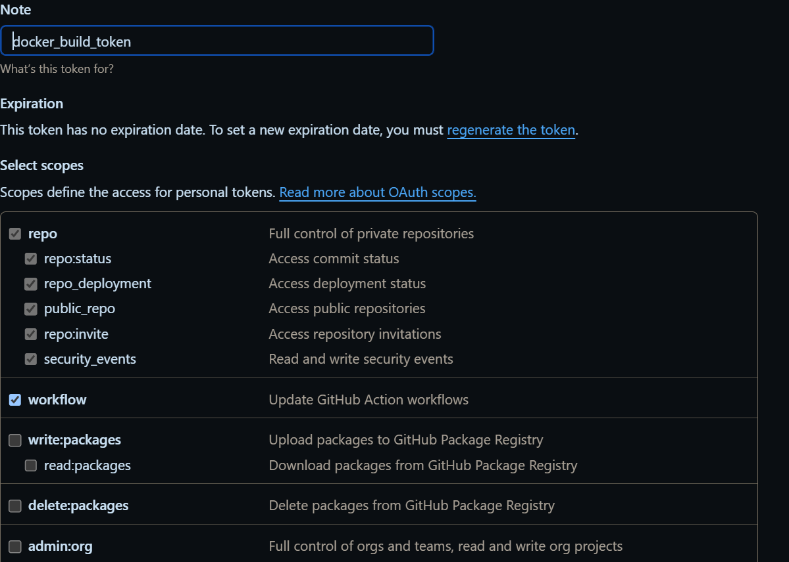
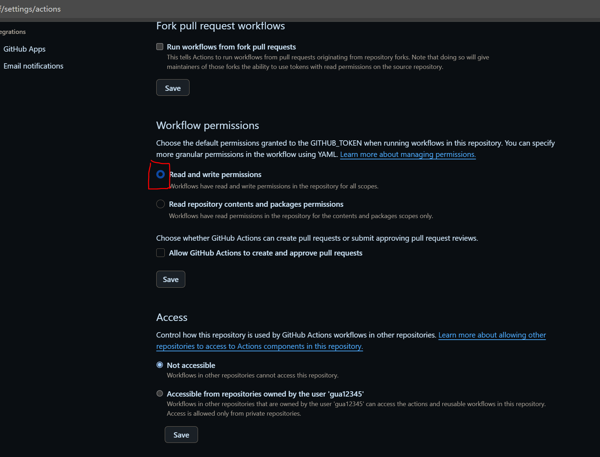
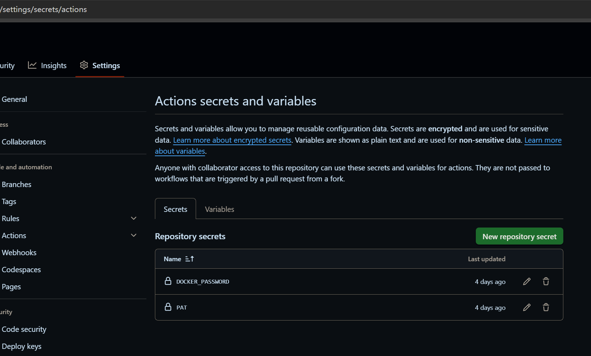
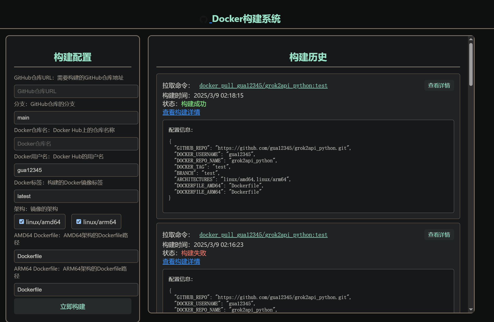

# 基于 GitHub Actions 的 Docker 打包系统

## 为什么做这个系统

以往使用 GitHub Actions 打包 Docker 镜像的流程较为繁琐，具体步骤如下：

1. 填写 `config.env` 文件。
2. 保存文件。
3. 手动触发 workflow。
4. 进入 `Actions` 页面。
5. 点击对应的 workflow。
6. 点击具体的 job，才能查看实时打包情况。

这种方式步骤多且不够直观，用户体验较差。

**现在的流程** 通过一个简洁的网页界面大幅简化了操作：

1. 打开网页。
2. 填写必要信息。
3. 点击“开始构建”。
4. 点击“查看构建详情”，即可直接跳转到 GitHub Actions 的实时打包情况。

此外，系统还支持**查看历史构建配置**，方便用户快速重新打包错误的 Docker 镜像，提升效率。

## 优势

- **简化流程**：从繁琐的多步骤操作简化为几次点击，大幅提升用户体验。
- **实时查看**：直接跳转到 GitHub Actions 的实时打包情况，无需手动导航。
- **历史记录**：支持查看和复用之前的构建配置，快速修复打包错误。

## 使用方法

按照以下步骤配置并使用本系统：

1. **克隆仓库**  
   将本项目克隆到您的 GitHub 账号下。

2. **获取 GitHub PAT**  
   访问 [GitHub PAT 设置页面](https://github.com/settings/tokens)，生成一个 Personal Access Token (PAT)，并确保勾选以下权限：  
   - `repo`（全选）  
   - `workflow`  
   

3. **设置 Workflow 权限**  
   在仓库中进入 `Settings` > `Actions` > `General`，确保 Workflow 具有修改仓库文件的权限。  
   

4. **设置 Actions Secrets**  
   在仓库的 `Settings` > `Secrets and variables` > `Actions` 中，添加以下两个 Secrets：  
   - `DOCKER_PASSWORD`：您的 Docker Hub 账号密码。  
   - `PAT`：您在第 2 步中生成的 GitHub PAT。  
   

5. **配置 Cloudflare Worker**  
   将 `worker.js` 文件复制到您的 Cloudflare Worker 中，并根据需要填写相应信息（例如 API 密钥、域名等）。

6. **将仓库转为私有**  
   为保护您的配置和 Secrets，建议将仓库设置为私有。

7. **访问系统**  
   完成以上步骤后，您可以通过访问 `您的域名/您的路径密码` 来使用 Docker 构建系统。  
   

## 图片显示说明

所有图片已放置在仓库的 `doc` 目录下，并在 README.md 中使用相对路径引用（如 `doc/pat_permissions.png`）。请确保克隆仓库后，`doc` 目录中的图片文件完整，以保证显示正常。

## 开源协议

本项目采用 [MIT](LICENSE) 开源协议，详情请参阅仓库根目录下的 `LICENSE` 文件。

